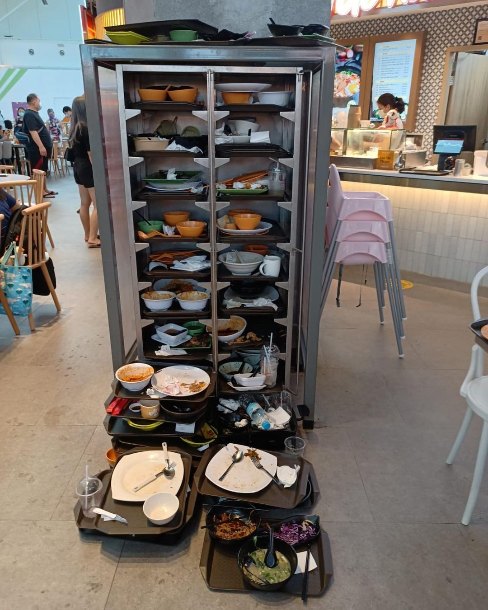

# Clear-table
 For a tkkyia project  

# Problem Analysis
 Hawker centers are cool, with Singapore's hawker culture being a part of UNESCO cultural Intangible cultural heritage.  
 Cheap and tasty food, as well as a place for interaction are all part of its appeal.  
 However, during peak hours, seats are almost impossible to find, much less clean seats.  
 Futhermore, now that tray return is mandatory, many of the cleaners are stationed at the tray return point.  
 When this happens, they are unaware of which tables are uncleaned as they are no longer clearing the tables.  
 Sometimes, the tables look clean, but still have germs on it.  
 Yet, if cleaners were to go around to clean the tbales, the tray return point piles up with uncleaned dishes really quickly.  
 
 Thus, this project aims to create a system that is able to inform the patrons and cleaners which tables are occupied or are not yet cleaned.  

# Methodology
 How many people are at a seat  
 We know a chair is occupiued if there is pressure on the chair.  
 Thus, each chair will have a pressure sensor.  
 But that only tells us how many chairs are being sat on.  
 How do we know how many chairs are occupied for a single table?  
 By making the parent class (table) store a list its chairs,  
 and sending the data of which specific chair is being sat on.  
 What if someone is just putting something on it? i.e. Can we choose not to detect if someone is choping?  
 This is an option left for the hawker centers to decide. (because I personally think choping is fine)  
 This is why we use pressure sensors.  
 By using two pieces of low resistance metal,  
 When more weight is put on it,  
 The metals get in contact more and there will be less resistance.  
 Thus, we can can set a threshold for a minimum pressure to set off the sensor.  
  
 Whether a table is clean:  
 A table is unclean after someone dines at that table.  
 We are able to know if someone is eating at the table if there is a pressure detected.  
 Thus, pressure sensors will be used on each table.  
 How do we know that the person is dining there and not just accidentally touched the table or is resting for a while?  
 Thus a "eating time" is defined.  
 If the pressure is detected for longer than 10 mins, we can be certain that the person is dining.  
 But what if the person lifts up his bowl to drink his soup?  
 Thus, a debounce time of 30s is added.  
 However, in our experience of dining, there is almost always a pressure on the table, so this is just for precaution.  
  
 Another thing to consider is when a person immdiately sits down after another one is finished dining e.g. during peak period.  
 Do we need to consider this case?  
 Well, no.  
 In real life cases, usually a cleaner would not go to clear the table (even before the mandate)  
  
 Now that we have defined when to change the table status to unclean, how do we know when to change the table status to clean?  
 There are two conditions when this happens:  
 1. When there is a person dining on the table.  
 - We know this occurs when there is a pressure on the table.  
 - Thus, if a pressure is detected, the table status would be changed to clean.  
 - Once the pressure is released, the table status would revert back to its previous status.  
 2. When a cleaner cleans the table.  
 - There is no reliable way to know when the table is cleaned.  
 - Thus, we need the cleaner to inform the program that the table is cleaned.  
 - This is done so in 2 ways:  
 2.1 Applying pressure on the table in a certain order e.g. short press, short press, long press, short press  
 - However, just in case the cleaner forgot to do that,  
 2.2 The cleaner may also directly select on the program the tables which are cleaned and submit the form.  

# Final Product
 The final product is a:  
 - Web app and mobile application with a layout of the coffee shop/ hawker center/ etc,  
 - that can detect how many people are at that table and  
 - when a person is finished eating, changing the table's status accordingly,  
 - and allow cleaners to inform it (the system) which tables are cleaned, and change the table status accordingly.  
 - With:  
   - Arduino (Uno)  
   - Pressure sensors (buttons & home-made pressure senors)  
   - HC-05  
   - Wires, Resistors (10k ohms), a Breadboard  
 - as the hardware,  
 - using:  
   - Python flask  
   - Arduino IDE  
   - and Flutter (Dart)  
 - as the software.  
  

# Notes:
 This only contain codes for the web app part.  
 Codes for the mobile app found here: https://github.com/LeeJingPeng/SeatFindr  
 Both uses the same logic  
 app2.py and table2.ino are the final ver, Although time values used are only for demo.  

# To do:
 Make circuit diagram for arduino